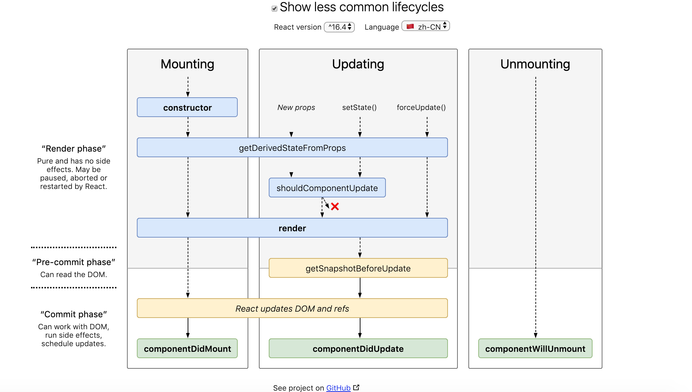

### React框架基础知识点
0.React元素、React 组件
React元素：html标签、组件、组件式表达式
React 组件是MyComponent，React 元素就是<MyComponent />
组件就是方法，元素就是组件实例化

1.React元素有4个属性
React.createElement(
    type,
    [props],
    [...children]
)
type props ref key因为 ref 不是一个属性，所以 Refs 不会被传递。就像 key 一样，React 会以不同的方式处理它

2.key值：在开发过程中，我们需要保证某个元素的 key 在其同级元素中具有唯一性。在 React Diff 算法中 React 会借助元素的 Key 值来判断该元素是新近创建的还是被移动而来的元素，从而减少不必要的元素重渲染。此外，React 还需要借助 Key 值来判断元素与本地状态的关联关系，因此我们绝不可忽视转换函数中 Key 的重要性。
key值必须唯一并稳定不变
render () {
  return (
    <ul>
      {this.state.todoItems.map(({task, uid}) => {
        return <li key={uid}>{task}</li>
      })}
    </ul>
  )
}
设计原则：必须稳定不变的、唯一
不加key时的默认操作，react会创建新的item实例插入最后面，原先的两条内容发生props更新，最新的为第三条
加入key之后，新创建的会插入到最前面，后面两条发生内容更新，如果props未更新就不更新
目的就是在一次循环中，找到与新节点对应的老节点，复用节点，节省开销。
3.ref使用
ref 属性来获得 React 元素
* 当 ref 属性被用于一个普通的 HTML 元素时，React.createRef() 将接收底层 DOM 元素作为它的 current 属性以创建 ref 。
* 当 ref 属性被用于一个自定义类组件时，ref 对象将接收该组件已挂载的实例作为它的 current 。
* 你不能在函数式组件上使用 ref 属性，因为它们没有实例，ref指向的是组件的实例this，函数式组件没有(hooks中可以)
* 父组件访问子组件的dom节点(使用 ref 回调函数，在实例的属性中存储对 DOM 节点的引用。)
4.react生命周期

React16新的生命周期弃用了 componentWillMount、componentWillReceivePorps，componentWillUpdate新增了 getDerivedStateFromProps、getSnapshotBeforeUpdate来代替弃用的三个钩子函数。
Render 阶段-纯净且不包含副作用。可能会被 React 暂停，中止或重新启动。
Commit 阶段-可以使用 DOM，运行副作用，安排更新。
挂载阶段
staticgetDerivedStateFromProps(props,state)
render
componentDidMount
getDerivedStateFromProps：组件每次被 rerender的时候，包括在组件构建之后(虚拟 dom之后，实际 dom挂载之前)，每次获取新的 props或 state之后；每次接收新的props之后都会返回一个对象作为新的 state，返回null则说明不需要更新 state；配合 componentDidUpdate，可以覆盖 componentWillReceiveProps的所有用法
更新阶段
staticgetDerivedStateFromProps(props,state)
shouldComponentUpdate
render
getSnapshotBeforeUpdate(prevProps,prevState)
componentDidUpdate
getSnapshotBeforeUpdate：触发时间: update发生的时候，在 render之后，在组件 dom渲染之前；返回一个值，作为 componentDidUpdate的第三个参数；配合 componentDidUpdate, 可以覆盖 componentWillUpdate的所有用法
卸载阶段
componentWillUnmount
错误处理
componentDidCatch
React16新的生命周期弃用了 componentWillMount、componentWillReceivePorps，componentWillUpdate新增了 getDerivedStateFromProps、getSnapshotBeforeUpdate来代替弃用的三个钩子函数。
React16并没有删除这三个钩子函数，但是不能和新增的钩子函数混用， React17将会删除这三个钩子函数，新增了对错误的处理（ componentDidCatch）
值得一提的是，在将更改应用到 DOM 时，React 内部也有阶段概念。它们按如下方式分隔开：
Render 组件将会进行无副作用渲染。这适用于纯组件（Pure Component），在此阶段，React 可以暂停，中止或重新渲染。
Pre-commit 在组件实际将更改应用于 DOM 之前，有一个时刻允许 React 通过getSnapshotBeforeUpdate()捕获一些 DOM 信息（例如滚动位置）。
Commit React 操作 DOM 并分别执行最后的生命周期： componentDidMount() 在 DOM 渲染完成后调用, componentDidUpdate() 在组件更新时调用
5.react中错误机制
getDerivedStateFromError
在子代组件抛出异常后会调用此生命周期方法。它以抛出的异常对象作为参数，并返回一个值用于更新状态
getDerivedStateFromError() 会在渲染阶段调用，因此不允许出现副作用
componentDidCatch-错误边界则是使用在屏幕上呈现声明性代码
错误边界是在其子组件树中的任何位置捕获 JavaScript 错误、记录这些错误并显示回退 UI 而不是崩溃的组件树的组件
在渲染期间事件处理器不会被执行或调用。会在“提交”阶段被调用，因此允许执行副作用。 它应该用于记录错误之类的情况
错误边界不起作用的情况：
* 在事件处理器内。
* setTimeout 或 requestAnimationFrame 回调中的异步代码。
* 在服务端渲染期间。
* 错误边界代码本身中引发错误时。
Try catch 块使用命令式代码-try...catch只能捕获到同步的运行时错误，对于语法和异步错误无能为力，捕获不到
6.虚拟Dom是什么？
在原生的 JavaScript程序中，我们直接对 DOM进行创建和更改，而 DOM元素通过我们监听的事件和我们的应用程序进行通讯。

而 React会先将你的代码转换成一个 JavaScript对象，然后这个 JavaScript对象再转换成真实 DOM。这个 JavaScript对象就是所谓的虚拟 DOM。

当我们需要创建或更新元素时， React首先会让这个 VitrualDom对象进行创建和更改，然后再将 VitrualDom对象渲染成真实DOM。

当我们需要对 DOM进行事件监听时，首先对 VitrualDom进行事件监听， VitrualDom会代理原生的 DOM事件从而做出响应
虚拟Dom比普通Dom更快吗？
直接操作 DOM是非常耗费性能的，这一点毋庸置疑。但是 React使用 VitrualDom也是无法避免操作 DOM的。

如果是首次渲染， VitrualDom不具有任何优势，甚至它要进行更多的计算，消耗更多的内存。

VitrualDom的优势在于 React的 Diff算法和批处理策略， React在页面更新之前，提前计算好了如何进行更新和渲染 DOM。实际上，这个计算过程我们在直接操作 DOM时，也是可以自己判断和实现的，但是一定会耗费非常多的精力和时间，而且往往我们自己做的是不如 React好的。所以，在这个过程中 React帮助我们"提升了性能"。

所以，我更倾向于说， VitrualDom帮助我们提高了开发效率，在重复渲染时它帮助我们计算如何更高效的更新，而不是它比 DOM操作更快。
7.虚拟Dom中的$$typeof属性的作用是什么？
dangerouslySetInnerHTML
dangerouslySetInnerHTML 是 React 为浏览器 DOM 提供 innerHTML 的替换方案。通常来讲，使用代码直接设置 HTML 存在风险，因为很容易无意中使用户暴露于跨站脚本（XSS）的攻击。因此，你可以直接在 React 中设置 HTML，但当你想设置 dangerouslySetInnerHTML 时，需要向其传递包含 key 为 __html 的对象
ReactElement中有一个 $$typeof属性，它被赋值为 REACT_ELEMENT_TYPE
 $$typeof是一个 Symbol类型的变量，这个变量可以防止 XSS。
 React渲染时会把没有 $$typeof标识，以及规则校验不通过的组件过滤掉
8.React组件的渲染流程是什么？
使用 React.createElement或 JSX编写 React组件，实际上所有的 JSX代码最后都会转换成 React.createElement(...)， Babel帮助我们完成了这个转换的过程。
createElement函数对 key和 ref等特殊的 props进行处理，并获取 defaultProps对默认 props进行赋值，并且对传入的孩子节点进行处理，最终构造成一个 ReactElement对象（所谓的虚拟 DOM）。
ReactDOM.render将生成好的虚拟 DOM渲染到指定容器上，其中采用了批处理、事务等机制并且对特定浏览器进行了性能优化，最终转换为真实 DOM。
9.为什么代码中一定要引入React？
JSX只是为 React.createElement(component,props,...children)方法提供的语法糖。
所有的 JSX代码最后都会转换成 React.createElement(...)， Babel帮助我们完成了这个转换的过程。
所以使用了 JSX的代码都必须引入 React。
10.为什么React组件首字母必须大写？

babel在编译时会判断 JSX中组件的首字母，当首字母为小写时，其被认定为原生 DOM标签， createElement的第一个变量被编译为字符串；当首字母为大写时，其被认定为自定义组件， createElement的第一个变量被编译为对象；
11.React在渲染真实Dom时做了哪些性能优化
在 IE（8-11）和 Edge浏览器中，一个一个插入无子孙的节点，效率要远高于插入一整个序列化完整的节点树。
React通过 lazyTree，在 IE（8-11）和 Edge中进行单个节点依次渲染节点，而在其他浏览器中则首先将整个大的 DOM结构构建好，然后再整体插入容器。
并且，在单独渲染节点时， React还考虑了 fragment等特殊节点，这些节点则不会一个一个插入渲染。
12.高阶组件
高阶组件可以看作 React对装饰模式的一种实现，高阶组件就是一个函数，且该函数接受一个组件作为参数，并返回一个新的组件。
属性代理
函数返回一个我们自己定义的组件，然后在 render中返回要包裹的组件，这样我们就可以代理所有传入的 props，并且决定如何渲染，实际上 ，这种方式生成的高阶组件就是原组件的父组件，上面的函数 visible就是一个 HOC属性代理的实现方式。
对比原生组件增强的项：
可操作所有传入的 props
可操作组件的生命周期
可操作组件的 static方法
获取 refs

反向继承
返回一个组件，继承原组件，在 render中调用原组件的 render。由于继承了原组件，能通过this访问到原组件的 生命周期、props、state、render等，相比属性代理它能操作更多的属性。
对比原生组件增强的项：

可操作所有传入的 props
可操作组件的生命周期
可操作组件的 static方法
获取 refs
可操作 state 可删除
可以渲染劫持
const HOC =(WrappedComponent)=>
    class extends WrappedComponent{
        render(){
            const elements = super.render();
            let newProps ={}
            if(elements && elements.Type === 'input'){
                newProps ={value:"word"}
            }
            const props =Object.assign({},elements.props,newProps)
            const newElements = React.cloneElement(elements,props, elements.props.children)
            
            return newElements
        }
    }
    
const WrappedComponent extends Component {
    render(){
        return(
            <input value ="hello">
        )
    }
}

export default HOC(WrappedComponent)
import React,{Component} from 'react'

const HOCFactory = (...params) =>{
    return (WrappedComponent) =>{
        return class HOC extends Component {
            render(){
                return <WrappedComponent {...this.props} />
            }
        }
    }
}

HOCFactory(param)(WrappedComponent)
设计原则：高阶组件-去扩展一个组件,具有通用功能，可以包装任意具备这功能的组件，相当于一个工程，而父子组件只能特定的组合
返回的组件具备输入组件不具备的功能-不去修改包裹组件里的内容与功能
如果你希望附加的功能和组件无关就hoc

13.开发设计/优化-asyncRouter懒加载路由，路由监听器
/* 路由懒加载HOC */
export default function AsyncRouter(loadRouter) {
  return class Content extends React.Component {
    constructor(props) {
      super(props)
      /* 触发每个路由加载之前钩子函数 */
      this.dispatchRouterQueue('before')
    }
    state = {Component: null}
    dispatchRouterQueue(type) {
      const {history} = this.props
      routerObserveQueue.forEach(item => {
        if (item.type === type) item.callback(history)
      })
    }
    componentDidMount() {
      if (this.state.Component) return
      loadRouter()
        .then(module => module.default)
        .then(Component => this.setState({Component},
          () => {
            /* 触发每个路由加载之后钩子函数 */
            this.dispatchRouterQueue('after')
          }))
    }
    render() {
      const {Component} = this.state
      return Component ? <Component {
      ...this.props
      }
      /> : null
    }
  }
}
react-router V5.0版本后用import和lazy去做异步加载

14.开发设计/优化-受控性组件颗粒化 ，独立请求服务渲染单元
### 颗粒化控制可控性组件
可控性组件和非可控性的区别就是dom元素值是否与受到react数据状态state控制
组件更新由组件单元自行控制，不需要父组件的更新，所以不需要父组件设置独立state保留状态
不是所有状态都应该放在组件的 state 中. 例如缓存数据。如果需要组件响应它的变动, 或者需要渲染到视图中的数据才应该放到 state 中。这样可以避免不必要的数据变动导致组件重新渲染.
### 建立独立的请求渲染单元
拆分需要单独调用后端接口的细小组件，建立独立的数据请求和渲染，这种依赖数据更新 -> 视图渲染的组件，能从整个体系中抽离出来

15.shouldComponentUpdate ,PureComponent 和 React.memo ,immetable.js 助力性能调优
细节问题
①绑定事件尽量不要使用箭头函数
function index(){
    const handerClick1 = useMemo(()=>(event)=>{
        const mes = event.currentTarget.dataset.mes
        console.log(mes) /* hello,world */
    },[])
    return 

        
hello,world

    

}
②循环正确使用key
③无状态组件hooks-useMemo 避免重复声明
对于无状态组件，数据更新就等于函数上下文的重复执行
function Index(){
    const [ number , setNumber  ] = useState(0)
    const handerClick1 = ()=>{
        /* 一些操作 */
    }
    const handerClick2 = ()=>{
        /* 一些操作 */
    }
    const handerClick3 = ()=>{
        /* 一些操作 */
    }
    return 

        <a onClick={ handerClick1 } >点我有惊喜1</a>
        <a onClick={ handerClick2 } >点我有惊喜2</a>
        <a onClick={ handerClick3 } >点我有惊喜3</a>
        <button onClick={ ()=> setNumber(number+1) } > 点击 { number } </button>
    

}
每次点击button的时候,都会执行Index函数
可以用 useMemo 做缓存
    const [ handerClick1 , handerClick2  ,handerClick3] = useMemo(()=>{
        const fn1 = ()=>{
            /* 一些操作 */
        }
        const fn2 = ()=>{
            /* 一些操作 */
        }
        const  fn3= ()=>{
            /* 一些操作 */
        }
        return [fn1 , fn2 ,fn3]
    },[]) 
④懒加载 Suspense 和 lazy

16.5种方式避免重复渲染
① 学会使用的批量更新
手动批量更新 
import unstable_batchedUpdates from 'react-dom'
const handerClick = () => {
    Promise.resolve().then(()=>{
        unstable_batchedUpdates(()=>{
            setB( { ...b } ) 
            setC( c+1 ) 
            setA( a+1 )
        })
    })
}
② 合并state
class类组件(有状态组件)
少写this.setState次数
函数组件(无状态组件)
对于无状态组件，我们可以通过一个useState保存多个状态，没有必要每一个状态都用一个useState。
③ useMemo React.memo隔离单元
function Index (){
    const [ list  ] = useState([ { id:1 , name: 'xixi' } ,{ id:2 , name: 'haha' },{ id:3 , name: 'heihei' } ])
    const [ number , setNumber ] = useState(0)
    return 

       { number }
       <button onClick={ ()=> setNumber(number + 1) } >点击</button>
           <ul>
               {
                useMemo(()=>(list.map(item=>{
                    console.log(1111)
                    return <li key={ item.id }  >{ item.name }</li>
                })),[ list ])
               }
           </ul>
        { useMemo(()=> <ChildrenComponent />,[]) }
    

}
有状态组件-React.memo
const NotUpdate = React.memo(({ children }:any)=> typeof children === 'function' ? children() : children ,()=>true)
用的就是 React.memo，生成了阻断更新的隔离单元，如果我们想要控制更新，可以对 React.memo 第二个参数入手， demo项目中完全阻断的更新。
④ ‘取缔’state，学会使用缓存。
这里的取缔state，并完全不使用state来管理数据，而是善于使用state,知道什么时候使用,怎么使用。react 并不像 vue 那样响应式数据流。在 vue中 有专门的dep做依赖收集，可以自动收集字符串模版的依赖项，只要没有引用的data数据， 通过 this.aaa = bbb ,在vue中是不会更新渲染的。因为 aaa 的dep没有收集渲染watcher依赖项。在react中，我们触发this.setState 或者 useState，只会关心两次state值是否相同，来触发渲染，根本不会在乎jsx语法中是否真正的引入了正确的值。
⑤ useCallback回调
useCallback 的真正目的还是在于缓存了每次渲染时 inline callback 的实例

17.状态管理
状态管理能够解决的问题主要分为两个方面，一 就是解决跨层级组件通信问题 。二 就是对一些全局公共状态的缓存
原则：不变的数据，多个页面可能需要的数据，放在状态管理中，对于时常变化的数据，我们可以直接请求接口
18.虚拟列表
虚拟列表是按需显示的一种技术，可以根据用户的滚动，不必渲染所有列表项，而只是渲染可视区域内的一部分列表元素的技术。正常的虚拟列表分为 渲染区，缓冲区 ，虚拟列表区。
为了防止大量dom存在影响性能，我们只对，渲染区和缓冲区的数据做渲染，，虚拟列表区 没有真实的dom存在。缓冲区的作用就是防止快速下滑或者上滑过程中，会有空白的现象

19.异步加载组件封装及路由钩子的实现
class AsyncBeforeEnter extends React.PureComponent {
    constructor(props) {
        super(props)
        this.state = {
            // 注意：此处component和render不会同时使用，同Route中component和render，render方法优先级要高
            // 目标组件 同 <Route componet>
            Component: null,
            // 目标组件render 方法  同 <Route render>
            render: null,
            // 错误信息
            error: null,
            // 标记异步是否完成
            completed: false
        }
    }
    componentDidMount() {
        const { beforeEnter, ...props } = this.props
        // beforeEnter 钩子函数
        const enter = beforeEnter({ ...props })
        if (isPromise(enter)) {
            // 判断是否是Promise
            enter
                .then(next => {
                    this.handleAfterEnter(next)
                })
                .catch(error => {
                    console.error(error)
                    this.setState({ error })
                })
        } else {
            this.handleAfterEnter(enter)
        }
    }
    handleAfterEnter(next) {
        // 结果处理
        const { route = {}, ...props } = this.props
        // 如果结果是null 或者undefined 或者 true ： 不做任何处理直接渲染组件
        if (next === null || next === undefined || next === true) {
            this.completed(route.component, route.render)
            return
        }
        // 返回false：阻止组件的渲染
        if (next === false) {
            this.completed(null)
            return
        }

        // 返回 string ： 跳转的路由，类似http中302状态码
        // 这里使用 React Router 的 Redirect 做跳转
        if (typeof next === 'string') {
            this.completed(null, () => <Redirect to={next} from={props.location.pathname} />)
            return
        }
        // 返回React 组件
        if (typeof next === 'function' || React.isValidElement(next)) {
            this.completed(null, () => next)
            return
        }

        // 返回 Object: 如果有 redirect=true 的属性，做跳转
        // 否则使用 Route 组件渲染
        if (isPlainObject(next)) {
            const { redirect, ...nextProps } = next
            if (redirect === true) {
                this.completed(null, () => <Redirect {...nextProps} {...{ from: props.location.pathname }} />)
                return
            }
            this.completed(() => <Route {...nextProps} />)
            return
        }
        warn(`"${props.location.pathname} => beforeEnter"
hook return values error. expected null? undefined? true? React.Component? HTMLElement? Route props?
route props detail to see
https://reacttraining.com/react-router/web/api/Route
https://reacttraining.com/react-router/web/api/Redirect`
        )
        // 例外情况 阻止组件的渲染
        this.completed(null)
    }
    /**
     * 完成后改变state渲染组件：
     * @param component 
     * @param render 
     */
    completed(component, render) {
        this.setState({ Component: component, render, completed: true, error: null })
    }

    getExtraProps() {
        // 去掉钩子函数，获取其他props
        const { loading: Loading, beforeEnter, ...props } = this.props
        return { ...props }
    }
    render() {
        const { Component, render, error, completed } = this.state
        if (!completed) {
            // 未完成
            return null
        }
        // 已完成
        if (render && typeof render === 'function') {
            return render(this.getExtraProps())
        }
        return Component ? <Component {...this.getExtraProps()} /> : null
    }
}