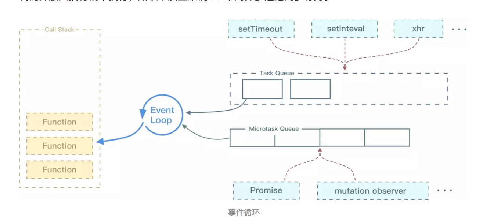
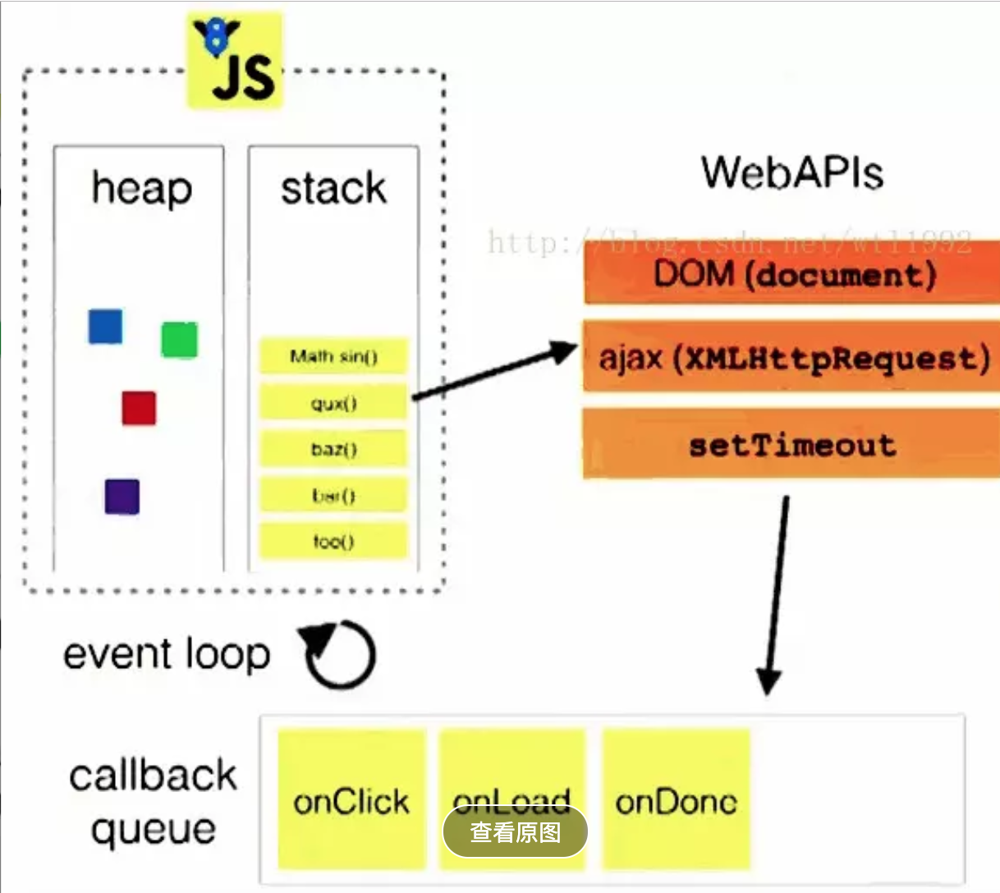

### 事件循环
	•	同步和异步任务分别进入不同的执行"场所"，同步的进入主线程，异步的进入Event Table并注册函数。
	•	当指定的事情完成时，Event Table会将这个函数移入Event Queue。
	•	主线程内的任务执行完毕为空，会去Event Queue读取对应的函数，进入主线程执行。
	•	上述过程会不断重复，也就是常说的Event Loop(事件循环)
那怎么知道主线程执行栈为空啊？js引擎存在monitoring process进程，会持续不断的检查主线程执行栈是否为空，一旦为空，就会去Event Queue那里检查是否有等待被调用的函数。

微任务包括 process.nextTick ，promise ，Object.observe ，MutationObserver
宏任务包括 script ， setTimeout ，setInterval ，setImmediate ，I/O ，UI rendering

事件循环的顺序，决定js代码的执行顺序。进入整体代码(宏任务)后，开始第一次循环。接着执行所有的微任务。然后再次从宏任务开始，找到其中一个任务队列执行完毕，再执行所有的微任务
在事件循环中，用户代理会不断从task队列中按顺序取task执行，每执行完一个task都会检查microtask队列是否为空（执行完一个task的具体标志是函数执行栈为空），如果为空则会一次性执行完所有microtask。然后再进入下一个循环去task队列中取下一个task执行...
执行栈是否为空，是检查微任务队列的判断条件，Microtasks通常安排在当前正在执行的脚本之后直接发生的事情
如果为空则会一次性执行完所有microtask
不为空继续该任务
* 首先执行同步代码，这属于宏任务
* 当执行完所有同步代码后，执行栈为空，查询是否有异步代码需要执行
* 执行所有微任务
* 当执行完所有微任务后，如有必要会渲染页面
* 然后开始下一轮 Event Loop，执行宏任务中的异步代码，也就是 setTimeout 中的回调函数
这里很多人会有个误区，认为微任务快于宏任务，其实是错误的。因为宏任务中包括了 script ，浏览器会先执行一个宏任务，接下来有异步代码的话才会先执行微任务。

总结
事件循环决定了代码的执行顺序，从全局上下文进入函数调用栈开始，直到调用栈清空，然后执行所有的micro-task（微任务），当所有的micro-task（微任务）执行完毕之后，再执行macro-task（宏任务），其中一个macro-task（宏任务）的任务队列执行完毕（例如setTimeout 队列），再次执行所有的micro-task（微任务），一直循环直至执行完毕。
1. 不同的任务会放进不同的任务队列之中。
2. 先执行macro-task，等到函数调用栈清空之后再执行所有在队列之中的micro-task。
3. 等到所有micro-task执行完之后再从macro-task中的一个任务队列开始执行，就这样一直循环。
事件循环：JS 会创建一个类似于 while (true) 的循环，每执行一次循环体的过程称之为 Tick。每次 Tick 的过程就是查看是否有待处理事件，如果有则取出相关事件及回调函数放入执行栈中由主线程执行。待处理的事件会存储在一个任务队列中，也就是每次 Tick 会查看任务队列中是否有需要执行的任务。
JS 只有一个线程，称之为主线程。而事件循环是主线程中执行栈里的代码执行完毕之后，才开始执行的。
❤来自不同任务源的任务可能会放在不同的任务队列中,FIFO
一个事件循环里有很多个任务队列（task queues）来自不同任务源，每一个任务队列里的任务是严格按照先进先出的顺序执行的，但是不同任务队列的任务的执行顺序是不确定的。浏览器会自己调度不同任务队列
事件循环中，用户代理会不断从task队列中按顺序取task执行，每执行完一个task都会检查microtask队列是否为空（执行完一个task的具体标志是主线程-函数执行栈为空），如果为空则会一次性执行完所有microtask。然后再进入下一个循环去task队列中取下一个task执行
setTimeout这个函数将在下一个事件循环中执行（注意这时候setTimeout执行完毕就返回了）
❤只要没有其他JavaScript处于执行中期，并且在每个任务结束时，就会在回调后处理微任务队列。
回调的时候(事件冒泡)会有所差异
只要没有其他JavaScript处于执行中期，并且在每个任务结束时，微调任务队列就会在回调后处理。在微任务期间排队的任何其他微任务都会添加到队列的末尾并进行处理。Microtasks包括变异观察者回调
因为微任务总是在下一个任务之前发生。
这意味着微任务在侦听器回调之间运行，但.click()会导致事件同步调度，因此调用的脚本.click()仍然在回调之间的堆栈中。
#### 原型链关系图

示例

  

var outer = document.querySelector('.outer');
var inner = document.querySelector('.inner');

// Let's listen for attribute changes on the
// outer element
new MutationObserver(function () {
  console.log('mutate');
}).observe(outer, {
  attributes: true,
});

// Here's a click listener…
function onClick() {
  console.log('click');

  setTimeout(function () {
    console.log('timeout');
  }, 0);

  Promise.resolve().then(function () {
    console.log('promise');
  });

  outer.setAttribute('data-random', Math.random());
}

// …which we'll attach to both elements
方式1
inner.addEventListener('click', onClick);
outer.addEventListener('click', onClick);
click
promise
mutate
click
promise
mutate
timeout
timeout

方式2
inner.click();
click
click
promise
mutate
promise
timeout
timeout

浏览器一帧的事件循环
所以正确的一次 Event loop 顺序是这样的
1. 执行同步代码，这属于宏任务
2. 执行栈为空，查询是否有微任务需要执行
3. 执行所有微任务
4. 当 Event loop 执行完 Microtasks 后，会判断 document 是否需要更新。因为浏览器是 60Hz 的刷新率，每 16ms 才会更新一次。
5. 然后判断是否有 resize 或者 scroll ，有的话会去触发事件，所以 resize 和 scroll 事件也是至少 16ms 才会触发一次，并且自带节流功能。
6. 判断是否触发了 media query
7. 更新动画并且发送事件
8. 判断是否有全屏操作事件
9. 执行 requestAnimationFrame 回调
10. 执行 IntersectionObserver 回调，该方法用于判断元素是否可见，可以用于懒加载上，但是兼容性不好
然后开始下一轮 Event loop，执行宏任务中的异步代码
11. 更新界面
12. 以上就是一帧中可能会做的事情。如果在一帧中有空闲时间，就会去执行 requestIdleCallback 回调。

输入事件的处理。从合成线程将输入的数据，传递到主线程的事件处理函数。所有的事件处理函数（touchmove，scroll，click）都应该最先触发，每帧触发一次，但也不一定这样；调度程序会尽力尝试，但是是否真的每帧触发因操作系统而异。从用户交互事件，到事件被交付主线程，二者之间也存在延迟。

一帧可能执行多个task
执行如下代码后，屏幕会先显示红色再显示黑色，还是直接显示黑色？

document.body.style.background = 'red';
setTimeout(function () {
    document.body.style.background = 'black';
})
1
2
3
4
答案是：不一定。

如果这2个task在同一帧中执行，则页面渲染一次，直接显示黑色（如下图情况一）。

如果这2个task被分在不同帧中执行，则每一帧页面会渲染一次，屏幕会先显示红色再显示黑色（如下图情况二）。

如果我们将setTimeout的延迟时间增大到17ms，那么基本可以确定这2个task会在不同帧执行，则“屏幕会先显示红色再显示黑色”的概率会大很多。
如果taskA执行时间超过了16.6ms（比如taskA中有个很耗时的while循环）。

那么这一帧就没有时间render，页面直到下一帧render后才会更新。表现为页面卡顿一帧，或者说掉帧。

最好的办法是时间切片，把长时间task分割为几个短时间task。