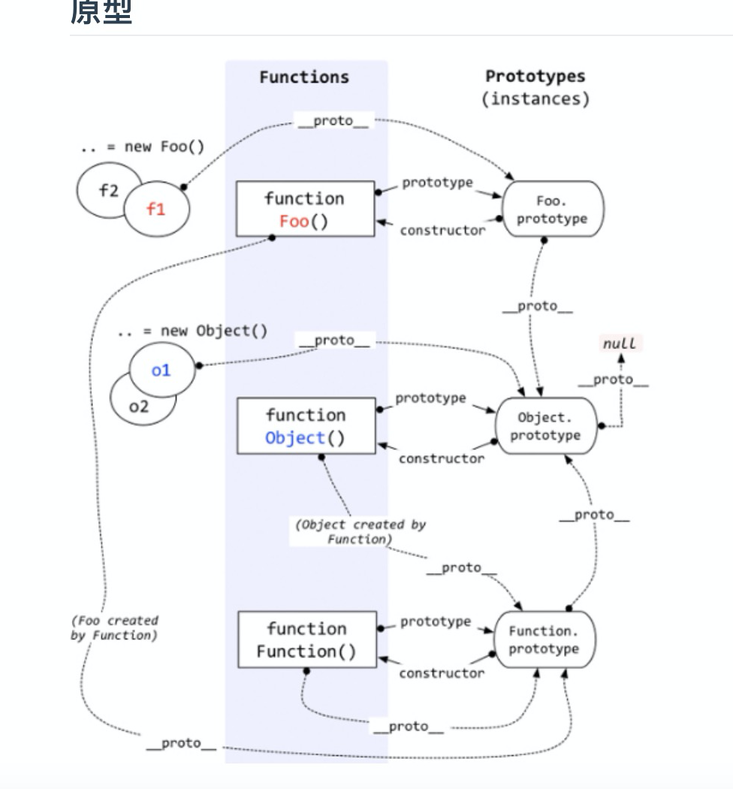

### 原型和原型链
 * **原型是一个对象，其他对象可以通过它实现属性继承，而且任何一个对象都可以成为原型**
 * **对象都是通过函数创建,对象是函数创建的，而函数却又是一种对象.为什么函数也是对象(constructor 指向了自己)**
 * **值类型的类型判断用typeof，引用类型的类型判断用instanceof；**
 * **注意：Object和Function两个方法同时有__proto__、prototype属性；**
 * **fn.__proto__ === Fn.prototype.这里的"__proto__"成为“隐式原型”。所以可以引用原型上的属性和方法；**
 * **每个函数都有一个属性叫做prototype（原型）。这个prototype的属性值是一个对象（属性的集合），默认的只有一个叫做constructor的属性，指向这个函数本身;**

#### 原型链知识
JavaScript引擎只有一个线程，强制异步事件排队等待执行原型链
* Object 是所有对象的爸爸，所有对象都可以通过 __proto__ 找到它
* Function 是所有函数的爸爸，所有函数都可以通过 __proto__ 找到它
* Function.prototype 和 Object.prototype 是两个特殊的对象，他们由引擎来创建
* 除了以上两个特殊对象，其他对象都是通过构造器 new 出来的
* 函数的 prototype 是一个对象，也就是原型
* 对象的 __proto__ 指向原型， __proto__ 将对象和原型连接起来组成了原型链

#### prototype与__proto__的区别
   两者都是对象类型的属性，并非所有的对象类型都有prototype属性，一般只有function对象才有prototype属性(除非主动赋值)，它指向的是一个对象，将来会被多个该function的实例所继承（或者说该对象处于多个实例的原型链上）；__proto__才是真正的原型链的实际指针
instanceof的判断队则是：沿着A的__proto__这条线来找，同时沿着B的prototype这条线来找，如果两条线能找到同一个引用，即同一个对象，那么就返回true。如果找到终点还未重合，则返回false。
所有构造器/函数的__proto__都指向Function.prototype，它是一个空函数（Empty function）
> 注意：let fun = Function.prototype.bind()
如果你以上述方法创建一个函数，那么可以发现这个函数是不具有 prototype 属性的
#### 原型链关系图



