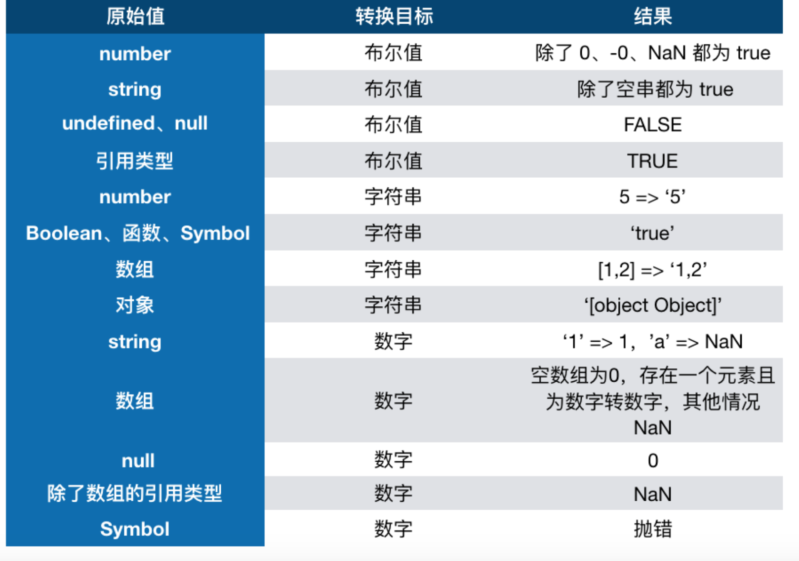

### 数据类型
* 1.基础类型-undefined、boolean、number、null、string、symble，引用类型 object、
暂时性死区只要一进入当前作用域，所要使用的变量就已经存在了，但是不可获取，只有等到声明变量的那一行代码出现，才可以获取和使用该变量。
* let const var区别
这是因为 JavaScript 引擎在扫描代码发现变量声明时，要么将它们提升到作用域顶部(遇到 var 声明)，要么将声明放在 TDZ 中(遇到 let 和 const 声明)。访问 TDZ 中的变量会触发运行时错误。只有执行过变量声明语句后，变量才会从 TDZ 中移出，然后方可访问。
上面讲了 let 不提升，不能重复声明，不能绑定全局作用域等等特性
let 会绑定当前的作用域
* 类型转换
显式类型转换（强制转换）。相对的，还有一种转换类型叫隐式类型转换
转Boolean
在条件判断时，除了 undefined， null， false， ''， NaN， 0， -0，其他所有值都转为 true，包括所有对象。
转字符串
toString() 方法返回一个表示该对象的字符串
数组将各元素以逗号连，对象转以[object Object]
boolean/函数/symbol 字符串‘true’
转数字
字符串转 数字 有字母就为NaN,数组：空数组为0，单个数字，为一个数字，其他为NaN,
null转为0，undefined和其他的转为NaN,symbole会抛错
对象转原始类型
对象在转换类型的时候，会调用内置的 [[ToPrimitive]] 函数，对于该函数来说，算法逻辑一般来说如下：
* 如果已经是原始类型了，那就不需要转换了
* 调用 x.valueOf()，如果转换为基础类型，就返回转换的值
* 调用 x.toString()，如果转换为基础类型，就返回转换的值
* 如果都没有返回原始类型，就会报错
③判断
x & 1 === 0为偶数。 x%2 === 0 为偶数
取整个数字或四舍五入：parseInt、math.ceil,math.floor,math.round四舍五入，|0，正则
~，被称为“按位不运算符”，等价于 - n - 1
~~可以有效的否定运算

* 转换为布尔值
* 转换为数字
* 转换为字符串
function MyNumberType(n) {
    this.number = n;
}

MyNumberType.prototype.valueOf = function() {
    return this.number;
};

var myObj = new MyNumberType(4);
myObj + 3; // 7
默认情况下，valueOf方法由Object后面的每个对象继承。 每个内置的核心对象都会覆盖此方法以返回适当的值。如果对象没有原始值，则valueOf将返回对象本身。
JavaScript的许多内置对象都重写了该函数，以实现更适合自身的功能需要。因此，不同类型对象的valueOf()方法的返回值和返回值类型均可能不同。
不同类型对象的valueOf()方法的返回值
对象	返回值
Array	返回数组对象本身。
Boolean	布尔值。
Date	存储的时间是从 1970 年 1 月 1 日午夜开始计的毫秒数 UTC。
Function	函数本身。
Number	数字值。
Object	对象本身。这是默认情况。
String	字符串值。
	Math 和 Error 对象没有 valueOf 方法。
你可以在自己的代码中使用valueOf将内置对象转换为原始值。
注意：字符串上下文中的对象通过 toString()方法转换，这与使用valueOf转换为原始字符串的String对象不同。所有对象都能转换成一个“[object 类型]”这种格式的字符串。但是很多对象不能转换为数字，布尔或函数
* 如果已经是原始类型了，那就不需要转换了
* 如果需要转字符串类型就调用 x.toString()，转换为基础类型的话就返回转换的值。不是字符串类型的话就先调用 valueOf，结果不是基础类型的话再调用 toString
* 调用 x.valueOf()，如果转换为基础类型，就返回转换的值
* 如果都没有返回原始类型，就会报错
除 Object 以外的所有类型都是不可变的（值本身无法被改变）。例如，与 C 语言不同，JavaScript 中字符串是不可变的（译注：如，JavaScript 中对字符串的操作一定返回了一个新字符串，原始字符串并没有被改变）。我们称这些类型的值为“原始值”。

typeof 可能的返回值。有关类型和原始值.值类型的类型判断用typeof，引用类型的类型判断用instanceof
Symbol.hasInstance用于判断某对象是否为某构造器的实例。因此你可以用它自定义 instanceof 操作符在某个类上的行为。
class Array1 {
  static [Symbol.hasInstance](instance) {
    return Array.isArray(instance);
  }
}
console.log([] instanceof Array1);
instanceof 运算符用来检测 constructor.prototype 是否存在于参数 object 的原型链,object instanceof constructor
b === b.prototype.constructor判断该方法是不是指向另外一个方法